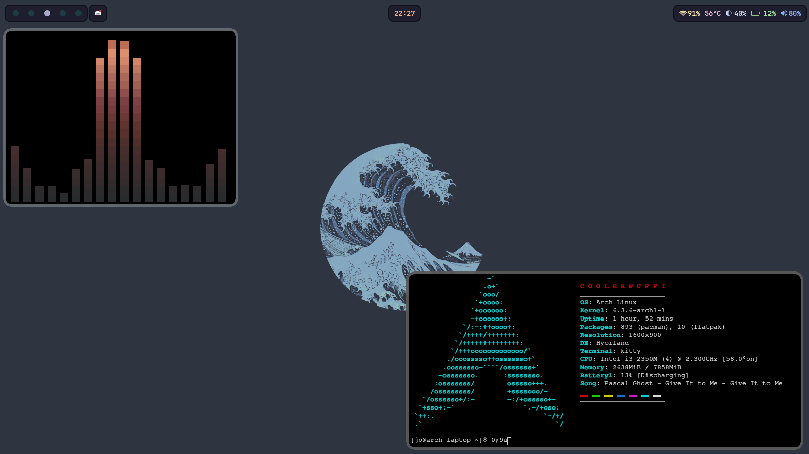

# hyprland-dotfiles
My Hyprland Dotfiles

Made on Arch Linux

## Screenshots


## Importent Keybinds
```SUPER + Q``` = opens Kitty

```SUPER + C``` = killactive

```SUPER + M``` = exit


## Dependencies
To install needed dependencies on Arch

Command to install dependencies with paru:

```paru -S kitty hyprland-git networkmanager swaylock-effects-git networkmanager-dmenu-git dbus waybar-hyprland-git swayidle playerctl dunst swww-git hyprshot ttf-jetbrains-mono-nerd rofi```

## Optional 
```paru -S brightnessctl pulsemixer```

## I hope you are using those
```paru -S pipewire pipewire-alsa pipewire-audio pipewire-jack pipewire-pulse wireplumber xdg-desktop-portal-hyprland-git xdg-desktop-portal-gtk xdg-desktop-portal```

## Some programms I recommend and use

Command to install programms with paru:

```paru -S librewolf nvim geary thunar xwaylandvideobridge-cursor-mode-2-git```
