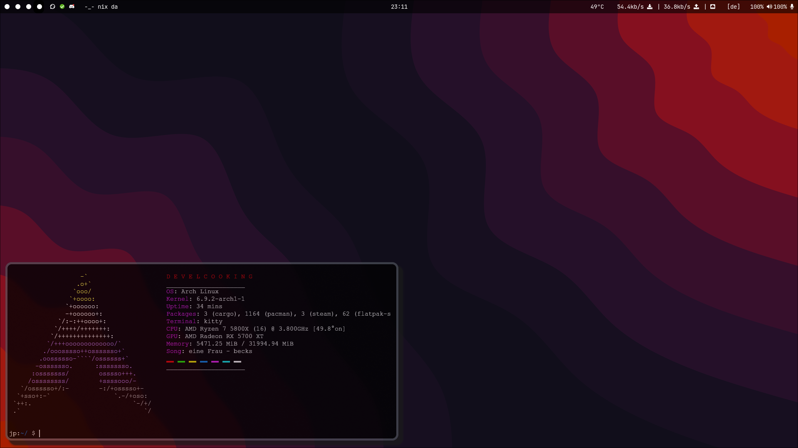

# dev-cooking's hyprland-dotfiles
My Hyprland Dotfiles that I stole from all around the internet and coded some parts myself/chatgpt. Most of the time the original Autor is marked in the files

Optimised from a 3 monitor desktop PC setup 

Made in Germany on Arch Linux

### Cool features
+ custom twitch live plugin for waybar
+ monitor independent virtual-workspaces
+ looks kinda nice
+ Every time Hyprland restarts random wallpaper for your Wallpaper directory
+ beautifull Wallpaper picker
+ Emoji, Bluetooth, Network selector screen via rofi
+ Systemwide mute funktion (R-CTRL + F12)
+ Media keys work (on my Corsair Keyboard)
+ all most all programms run native on wayland

### Others Opinion
+ mr_boost "Holy shit. That theming. I want to Cry"

## Previews
<details>
  <summary>Show</summary>
    
    
    
    
    
    

</details>

## Importent Keybinds
```SUPER + Q``` = opens Kitty

```SUPER + R``` = opens App selection screen

```SUPER + C``` = killactive

```SUPER + M``` = exit

## Installation
### Dependencies
To install needed dependencies on Arch

Command to install dependencies with paru:

```paru -S kitty hyprland-git papirus-icon-theme networkmanager swaylock-effects-git networkmanager-dmenu-git dbus waybar swayidle playerctl swaync swww hyprshot ttf-jetbrains-mono-nerd swayosd-git rofi rofi-bluetooth-git wlsunset-git cliphist rofimoji```

all of lbonn's rofi like rofi-bonn-wayland-only-git packages work poorly with the new Wallpaper picker screen

### Optional 
```paru -S brightnessctl pulsemixer```

### I hope you are using those
```paru -S pipewire pipewire-alsa pipewire-audio pipewire-jack pipewire-pulse wireplumber xdg-desktop-portal-hyprland-git xdg-desktop-portal-gtk xdg-desktop-portal```

### Some programms I recommend and use

Command to install programms with paru:

```paru -S librewolf-bin neovim thunderbird thunar thunar-archive-plugin thunar-volman tumbler ffmpegthumbnailer gvfs xwaylandvideobridge-bin```
